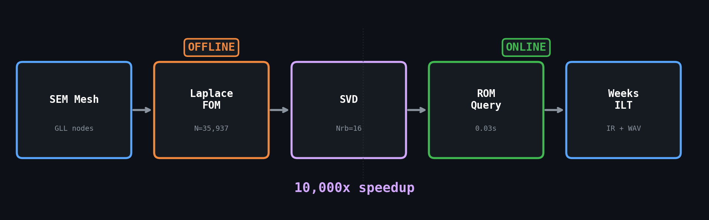

<p align="center">
  
  <p align="center">
    <strong>100-10,000x faster impulse responses with parametric boundaries</strong>
  </p>
  <p align="center">
    <a href="#install">Install</a> &bull;
    <a href="#quick-start">Quick Start</a> &bull;
    <a href="#parametric-rom">ROM</a> &bull;
    <a href="#api-reference">API</a> &bull;
    <a href="#validation">Validation</a> &bull;
    <a href="CHORAS_INTEGRATION.md">CHORAS Integration</a>
  </p>
</p>

---

Open-source Python implementation of the Laplace-domain Reduced Basis Method from:

> H. Sampedro Llopis, A.P. Engsig-Karup, C.-H. Jeong, F. Pind, J.S. Hesthaven (2022),
> *"Reduced basis methods for numerical room acoustic simulations with parametrized boundaries"*,
> J. Acoust. Soc. Am. 152(2), pp. 851-865.
> [DOI: 10.1121/10.0012696](https://doi.org/10.1121/10.0012696)

**No GPU required. No compiled code. Pure Python.**

<p align="center">
  
</p>

---

## Install

```bash
git clone https://github.com/Burhanuddin98/Reduced-Order-Modelling-SL.git
cd Reduced-Order-Modelling-SL/romacoustics
pip install -e .
```

Requirements: Python 3.8+, `numpy`, `scipy`, `matplotlib` (auto-installed).

---

## Quick Start

```python
from romacoustics import Room

room = Room.box_2d(2.0, 2.0, ne=20, order=4)   # 6561 DOFs
room.set_source(1.0, 1.0, sigma=0.2)
room.set_receiver(0.2, 0.2)
room.set_boundary_fi(Zs=5000)

ir = room.solve(t_max=0.1)

print(f'T30 = {ir.T30:.3f}s')
print(f'C80 = {ir.C80:.1f} dB')

ir.to_wav('room_impulse.wav')
ir.plot()
```

---

## Arbitrary Geometry

Load any closed 3D geometry — STL, OBJ, or Gmsh files. Surfaces are auto-detected by normal direction.

```python
# From STL (requires watertight mesh)
room = Room.from_stl('concert_hall.stl', f_max=400)

# From OBJ
room = Room.from_obj('bedroom.obj', f_max=300)

# From Gmsh .geo or .msh (Physical Surface tags become material labels)
room = Room.from_gmsh('L_shaped.geo', f_max=250)

# Per-surface materials (auto-detected: floor, ceiling, wall_north, etc.)
room.set_material('floor', 'carpet_thick')
room.set_material('ceiling', 'acoustic_panel')
room.set_material('wall_north', 'glass')
room.set_material('wall_south', 'concrete')

room.set_source(1.0, 1.0, 1.2)
room.set_receiver(3.0, 4.0, 1.0)

ir = room.solve(t_max=0.3, f_max=250)
print(f'T30 = {ir.T30:.3f}s')
```

Interior volume is automatically meshed with P1 tetrahedra via Gmsh. Mesh resolution is auto-computed from `f_max` (6 points per wavelength).

> **Note:** STL/OBJ import requires watertight (closed, manifold) geometry.

---

## Parametric ROM

Build the ROM **once** from a few training solves. Then query at **any** parameter value instantly.

```python
# Offline: ~10 min for 3 training impedances
rom = room.build_rom(Z_train=[500, 8000, 15500])

# Online: ~0.03s each
ir1 = rom.solve(Zs=3000)    # low absorption
ir2 = rom.solve(Zs=12000)   # high absorption  
ir3 = rom.solve(Zs=7777)    # anything in between
```

### 3D with frequency-dependent absorbers

```python
room = Room.box_3d(1.0, 1.0, 1.0, ne=8, order=4)   # 35,937 DOFs
room.set_source(0.5, 0.5, 0.5, sigma=0.2)
room.set_receiver(0.25, 0.1, 0.8)
room.set_boundary_fd(sigma_flow=10000, d_mat=0.05)   # Miki porous absorber

ir = room.solve(t_max=0.1)
ir.plot_spectrogram()

# Parametric over material thickness
rom = room.build_rom(d_train=[0.02, 0.12, 0.22])
ir_thin  = rom.solve(d_mat=0.03)   # 30mm absorber
ir_thick = rom.solve(d_mat=0.15)   # 150mm absorber
```

---

## Validation

### FOM correctness

| Test | Method | Result |
|------|--------|--------|
| Eigenfrequencies (rigid rect) | FFT peaks vs analytical | 9/10 match within 2.3 Hz |
| Laplace vs Time-domain (FI) | RK4 p-Phi cross-check | Relative error 6.85e-4 |
| Laplace vs Time-domain (rigid) | Three-way comparison | Relative error 2.49e-2 |

### ROM accuracy

| Case | N (FOM) | Nrb (ROM) | Relative Error | Speedup |
|------|---------|-----------|---------------|---------|
| 2D FI, Zs=5000 | 6,561 | 17 | 0.5% | 9,493x |
| 2D FI, Zs=15000 | 6,561 | 17 | 0.6% | 11,557x |
| 3D FD, d=0.05m | 35,937 | 16 | 0.8% | 6,750x |
| 3D FD, d=0.15m | 35,937 | 16 | 0.8% | 9,202x |

---

## API Reference

### `Room`

| Method | Description |
|--------|-------------|
| `Room.box_2d(Lx, Ly, ne=20, order=4)` | 2D rectangular room |
| `Room.box_3d(Lx, Ly, Lz, ne=8, order=4)` | 3D box room |
| `Room.from_gmsh(path, f_max=500)` | Arbitrary geometry from Gmsh .geo/.msh |
| `Room.from_stl(path, f_max=500)` | Arbitrary geometry from STL file |
| `Room.from_obj(path, f_max=500)` | Arbitrary geometry from OBJ file |
| `.set_source(*pos, sigma=0.2)` | Gaussian pulse source position |
| `.set_receiver(*pos)` | Receiver position |
| `.set_boundary_fi(Zs)` | Frequency-independent impedance [Pa s/m] |
| `.set_boundary_fd(sigma_flow, d_mat)` | Miki porous absorber on rigid backing |
| `.set_material(surface, name_or_Z)` | Per-surface material assignment |
| `.solve(t_max, fs, Ns)` | Full-order solve → `ImpulseResponse` |
| `.build_rom(Z_train= or d_train=)` | Build parametric ROM → `ROM` |

### `ROM`

| Method | Description |
|--------|-------------|
| `.solve(Zs= or d_mat=)` | Instant query → `ImpulseResponse` |
| `.Nrb` | Number of reduced basis vectors |

### `ImpulseResponse`

| Property / Method | Description |
|-------------------|-------------|
| `.signal`, `.t`, `.fs` | Raw data |
| `.T30`, `.T20`, `.EDT` | Reverberation times [s] |
| `.C80`, `.D50` | Clarity and definition |
| `.edc_db` | Energy decay curve [dB] |
| `.to_wav(path)` | Export 16-bit WAV |
| `.to_npz(path)` | Export numpy archive |
| `.plot()` | Waveform + EDC plot |
| `.plot_spectrogram()` | Time-frequency plot |

---

## How It Works

1. **Spectral Element Method** — GLL quadrature on structured quad/hex mesh. Kronecker product assembly gives diagonal mass matrix (no linear solve for mass).

2. **Laplace-domain FOM** — Transform wave equation to complex frequency domain: `(s²M + c²S + s·Br)p = s·M·p0`. One sparse linear solve per frequency.

3. **Weeks method** — Inverse Laplace transform via Laguerre polynomial expansion. Maps complex s-plane to unit circle, FFT gives expansion coefficients.

4. **Reduced basis** — Cotangent-lift SVD of snapshot matrix. Captures 99.9999% of energy in 15-20 vectors out of 6000-36000 DOFs.

5. **Galerkin projection** — Project all operators onto reduced basis. Online solve is a dense Nrb × Nrb system (microseconds).

---

## CHORAS Integration

See [CHORAS_INTEGRATION.md](CHORAS_INTEGRATION.md) for:
- Celery task wrapper (copy-paste ready)
- Dockerfile
- JSON configuration schema
- Parametric ROM workflow

---

## Cite

If you use this code, please cite the original paper:

```bibtex
@article{sampedro2022,
  author  = {Sampedro Llopis, Hermes and Engsig-Karup, Allan P. and Jeong, Cheol-Ho and Pind, Finnur and Hesthaven, Jan S.},
  title   = {Reduced basis methods for numerical room acoustic simulations with parametrized boundaries},
  journal = {J. Acoust. Soc. Am.},
  volume  = {152},
  number  = {2},
  pages   = {851--865},
  year    = {2022},
  doi     = {10.1121/10.0012696}
}
```

## License

MIT
